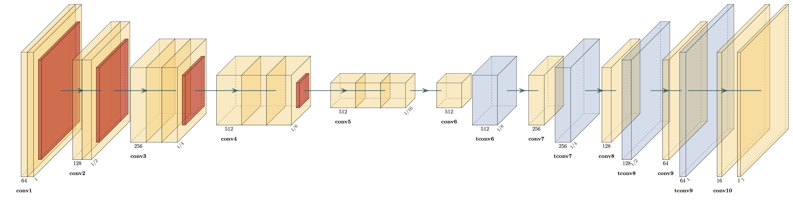

# Convolutional Neural Network of Density Maps for Crowd Counting

> White paper for the final exam of the "Vision and Cognitive Services" course at the University of Padova. This paper has been presented in July 2020.

## Abstract

The crowd counting problem aims to estimate the number of people within an image or a video-frame
from surveillance cameras. Accurate crowd counting is a challenging problem due to scale variations
and the lack of a big dataset of images labelled with the exact number of people depicted. This problem
is usually solved by estimating the density map generated from the people’s location annotations or
by leveraging deep convolutional networks. In this paper, we propose an alternative model that combines
relevant features of other models recently introduced in the literature. To demonstrate the
effectiveness of the proposed method, we conduct extensive experiments on 2 public crowd counting
datasets. Through extensive experiments, we were able to get 92.8 and 16.9 as MAE, 148.2 and 28.1 as
MSE in two difficult datasets: ShanghaiTech part A and B respectively.

## Paper

You can find the white paper in [pdf/paper.pdf](pdf/paper.pdf).

## Slides

You can find the presentation slides in [pdf/slides.pdf](pdf/slides.pdf).

## Team

I (Alberto Schiabel) have co-written this white paper along with my University mate and friend [Linpeng Zhang](https://github.com/linpengzhang).

## Code

We used Python 3.7, Tensorflow 2 and Keras for cleaning the datasets and creating our predictive models 
At the moment, the code and the trained models referred in the paper aren't publicly available.
